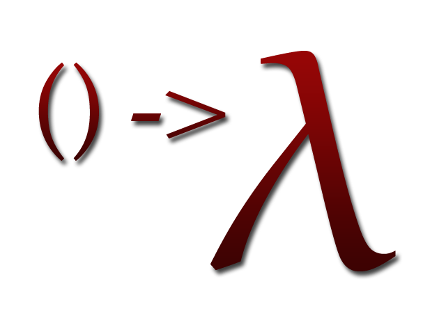
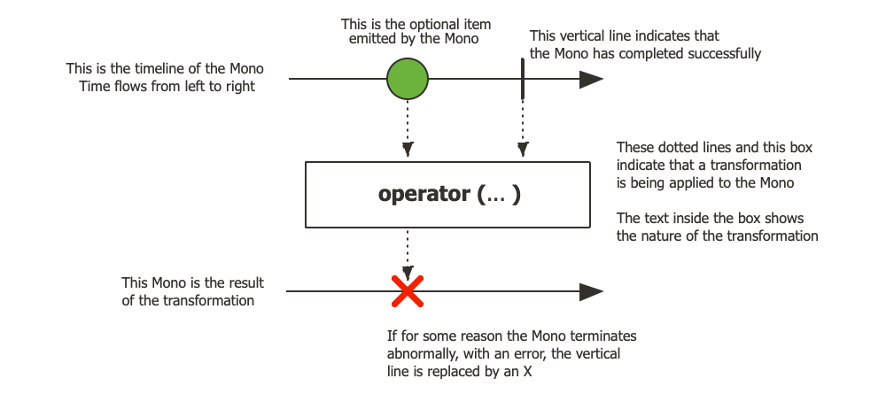

<p align="center">
	<a href="" rel="noopener">
	 
 </a>
</p>

<h3 align="center">Pro Replenishment lambda & Project Reactor</h3>

<div align="center">

[]()

</div>

---

Welcome 😀

This lab introduces you the lambda function and the use of the functional interfaces.

The second part is on the thread handling with `Callable` and the `Future`. We will see the limits with `Future` and i will present you the `Project Reactor`.

Good reading! 🌈

## 📝 Table of Contents
- [Functional Programming](#functional-programming)
    - [What is functional programming?](#what-is-functional-programming)
    - [What is a functional interface?](#what-is-a-functional-interface)
    - [What is a lambda expression?](#what-is-a-lambda-expression)
    - [Standard functional interfaces](#standard-functional-interfaces)
        - [Consumer](#consumer)
        - [Predicate](#predicate)
        - [Supplier](#supplier)
        - [Function](#function)
    - [Method references](#method-references)
    - [Lambda expression limitations](#lambda-expression-limitations)
        - [Final](#final)
        - [This](#this)
- [Runnable and Callable interface introduction](#runnable-and-callable-interface-introduction)
- [Stream](#stream)
    - [Stream initialization](#stream-initialization)
        - [empty](#empty)
        - [of](#of)
        - [ofNullable](#ofnullable)
        - [iterate](#iterate)
        - [concat](#concat)
        - [Stream Builder interface](#stream-builder-interface)
    - [Intermediate and terminal operations](#intermediate-and-terminal-operations)
    - [Intermediate operations](#intermediate-operations)
        - [Filtering](#filtering)
        - [Mapping](#mapping)
        - [Sorting](#sorting)
        - [Peeking](#peeking)
    - [Terminal operations](#terminal-operations)
        - [For each element](#for-each-element)
        - [counting all elements](#counting-all-elements)
        - [Match all any and none](#match-all-any-and-none)
        - [Find any or first](#find-any-or-first)
        - [Optional class](#optional-class)
        - [Min and max](#min-and-max)
        - [To array](#to-array)
        - [Reduce](#reduce)
        - [Collect](#collect)
        - [Collectors](#collectors)
            - [ToList](#tolist)
            - [ToSet](#toset)
            - [ToMap](#tomap)
            - [Joining](#joining)
            - [SummingInt](#summingint)
            - [SummarizingInt](#summarizingint)
            - [PartitioningBy](#partitioningby)
            - [GroupingBy](#groupingby)
        - [Numeric stream](#numeric-stream)
            - [Range and rangeClosed](#range-and-rangeclosed)
            - [MapToInt](#maptoint)
            - [MapToLong](#maptolong)
            - [MapToDouble](#maptodouble)
            - [Boxed or mapToObj](#boxed-or-maptoobj)
            - [FlatMapToInt](#flatmaptoint)
- [Project Reactor](#project-reactor)
    - [Introduction to Reactive Programming](#introduction-to-reactive-programming)
    - [Flux](#flux)
    - [Mono](#mono)
    - [Simple Ways to create a Mono and Subscribe to it](#simple-ways-to-create-a-mono-and-subscribe-to-it)
    - [Simple Ways to create a Flux and Subscribe to it](#simple-ways-to-create-a-flux-and-subscribe-to-it)
    - [Combining publishers](#combining-publishers)
        - [Concat](#concat)
        - [ConcatWith](#concatwith)
        - [CombineLatest](#combinelatest)
        - [Merge](#merge)
        - [MergeSequential](#mergesequential)
        - [MergeWith](#mergewith)
---

## Functional Programming

Welcome into the world of functional programming. This chapter will introduce you to what a functional interface. The JDK provides this feature and allows to write the lambda expression.

### What is functional programming?

📌 **Consumer<T> function**

🛠 To get started, i choice an example :

```
List<String> names = List.of("Michael", "John", "Donald");
names.forEach(n -> System.out.print(n + " ")); //Michael John Donald
```

The `forEach` method is a perfect example for introduce the functional programming notion.This method which is provided in the `Iterable` interface takes one parameter of `Consumer<T>` type.

For each items in the names list, the function `Consumer<T>` is applied. In our example, each name is print in the Java console with the `System.out.print` function.

📌 **Predicate<T> function**

🛠 Let's take the second example :

```
List<String> names = new ArrayList<>(List.of("Michael", "John", "Donald"));
names.removeIf(p -> p.startsWith("Jo"));
names.forEach(n -> System.out.print(n + " ")); //Michael Donald
``` 

This is the `remoteIf` method of `Collection` interface. You can see the `Predicate<T>` function as a parameter.

```
default boolean removeIf(Predicate<? super E> filter) {
```

I introduce the `Predicate<T>` function which accepts a parameter and returns a boolean value :

```
names.removeIf(p -> p.startsWith("Jo"));
```

Each name starts with `Jo` are selected for the deletion. In our console, you get this result :

```
Michael Donald
```

📘 All theses examples give you a pretty good idea of how a lambda function can be write. The lambda expression and the functional interface are the base of functional programming.

### What is a functional interface?

When you define a function, like the `Consumer`, you implement an interface that has only one abstract method. That is how Java  manages the functional programming. The compiler looks at the interface (Consumer, Predicate, Function, BiFunction, ...) and checks that only one abstract method exists. The only requirement is that the passed-in-parameters must match the method signature.

🛠 This is an example :

```
@FunctionalInterface
public interface Consumer<T> {

    void accept(T t);

    default Consumer<T> andThen(Consumer<? super T> after) {
        Objects.requireNonNull(after);
        return (T t) -> { accept(t); after.accept(t); };
    }
}
```

As you can see, only one abstract method is declared in the Java functional interface : `void accept(T t)`. This is the only requirement with using the functional interface annotation.

📌 **Anonymous class**

Remember, the anonymous class are introduced by Java for event handling.

```
myButton.addActionListener(
	new ActionListener() {
		public void actionPerformed(ActionEvent e) {
			System.exit(0);
		}
	}
);
```

Or again, when you implement a Runnable :

```
Runnable runnable = new Runnable() {
	@Override
	public void run() {
		System.out.println("Hello Michael, how are you?");
	}
}
```

Now, with Java 8, the Runnable interface is becomes a functional interface.

```
@FunctionalInterface
public interface Runnable {
	public abstract void run();
}
```

Like following :

```
@FunctionalInterface
public interface Callable<V> {
    V call() throws Exception;
}
```

💡 This distinction is also made so that users uses these interfaces like a function.

Now we'll look at the lambda function.

### What is a lambda expression?

The term lambda was introduced by the mathematician Alonzo Church in the 1930s. A lambda expression is a function. In Java it is implemented as an anonymous method. The notation is particular, because it is a very compact notation.

The syntax of lambda expression includes a list of parameters, an arrow token and a body. The list of parameter can be empty, if this is the case, it is necessary to use `()`.

The body can be single expression or a statement block of code with braces `{}`.

🛠 Let's look a few examples :

- `() -> 42` (Supplier function)
- `x -> x / 3` (Function function)
- `(x, y) -> x * y` (BiFunction function)

If you remove the functional programming in Java, the only way to pass some functionality as a parameter would be the creation of class that implements an interface, you create its object and you passing it as a parameter. Now, if you use functional programming you have access to a very compact notation that is very very more elegant.

🛠 Another example :

`(x, s) -> {x++; System.out.println(s + "=" + x);};` You increment `x` and you display the result in the Java console.

Remember, the `Runnable` functional interface :

```
Runnable runnable = () -> System.out.println("Hello Michael, how are you?");
```

As you see, creating a lambda function is very easy with lambda expression. But before the creation of functional interface, you must consider using one of the 43 functional interfaces provided  in the package `java.util.function`. You may need to create a new functional interface, but these 43 functional interfaces will help you to write better code.

### Local-variable syntax for lambda parameters

Until the release of `Java 11`, there were two ways to declare parameter types :

- Implicitly
- Explicitly

Until here, we have used the implicitly syntax :

```
Predicate<String> predicate = name -> name.equalsIgnoreCase("mich");
```

Now, explicitly is :

```
Predicate<String> predicate = (String name) -> name.equalsIgnoreCase("mich");
```

We have see that one parameter, the `()` can be omitted. But here, the `()` are necessary because we use the explicitly declaration.

🛠 Another example :

```
BiFunction<Double, Integer, Double> calc = (Double x, Integer y) -> x / y;
System.out.println(calc.apply(10.0d, 2)); // 5.0
```

📌 **Java 11 comes**

Java 11 introduces the `var` type in parameter type of lambda function.

```
BiFunction<Double, Integer, Double> calc = (var x, var y) -> x / y;
System.out.println(calc.apply(10.0d, 2)); // 5.0
```

Remember, the `var` type was introduced in Java 10.

Now it's nice but i can also remove these `var` types and the lambda expression is done. But if i want introduce the validation package.

```
BiFunction<Double, Integer, Double> calc = (@NotNull var x, @NotNull var y) -> x / y;
		System.out.println(calc.apply(10.d, 2));
```

As you see, i can add `@NotNull` annotation and validate that the value is not null.
If you need to validate the content of the parameter, you can use these annotations. Before Java 11, you wrote as follows :

```
BiFunction<Double, Integer, Double> calc = (@NotNull Double x, @NotNull Integer y) -> x / y;
		System.out.println(calc.apply(10.d, 2));
```

Open your mind and considered this :

```
(@NotNull MyPowerAndBeautilfulLongClassName x) -> x.display();
```

Explicit declaration when using a very long class name degrades the syntactic quality that allows lambda expression.

### Standard functional interfaces

43 default functional interface are available in the package `java.util.function`. We'll see `Consumer<T>`, `Predicate<T>`, `Supplier<T>` and `Function<T, R>`.

### Consumer

`Consumer<T>` is a functional interface which contais only one abstract method : `void accept(T t);`.

```
@FunctionalInterface
public interface Consumer<T> {

    /**
     * Performs this operation on the given argument.
     *
     * @param t the input argument
     */
    void accept(T t);

    default Consumer<T> andThen(Consumer<? super T> after) {
        Objects.requireNonNull(after);
        return (T t) -> { accept(t); after.accept(t); };
    }
}
```

As you can see, the `default` method name `andThen` is implemented in an interface. Normally, an interface does not contain any code. But here, we have a functional interface that has been defined to write the lambda function. The `default` methods are also called `operations` and can be used for creating operation chains, also called `pipelines`. It's very important to understand this particularity.

🛠 We start with an example :

```
Consumer<String> print = value -> System.out.println("Result : " + value);
print.accept("Michael Jordan"); //Result : Michael Jordan
```

🛠 Creating a pipeline

```
Consumer<String> firstAction = value -> System.out.print("Result : " + value);

Consumer<String> complete = firstAction.andThen(then -> System.out.println(" is the better !"));

complete.accept("Michael Jordan"); //Result : Michael Jordan is the better !
```

### Predicate

This functional interface has only one abstract method which is `boolean test(T t)`, five default and a static method.

🛠 Let's go with an example :

```
Predicate<String> first = Predicate.isEqual("Michael Jordan");
assertTrue(first.test("Michael Jordan"));
```

Here i use a static method named `isEqual` which allows to create a `Predicate<String>`.

I also can create the `Predicate<T>` function like that and get the same result :

```
Predicate<String> mj = n -> n.equals("Michael Jordan");
assertTrue(mj.test("Michael Jordan"));
```

🛠 Several examples

```
Predicate<Integer> isLessThan20 = v -> v < 20;
assertTrue(isLessThan20.test(17));
assertFalse(isLessThan20.test(22));
```

🛠 Now we'll create a pipeline

We'll use the operator named `and`.

```
Predicate<Integer> isGreaterThan10 = v -> v > 10;
Predicate<Integer> between = isGreaterThan10.and(isLessThan20);
assertTrue(between.test(18));
assertFalse(between.test(22));
assertFalse(between.test(10));
assertTrue(between.test(11));
```

📌 **Where is the pipeline?**

`isGreaterThan10.and(isLessThan20);` The `and` operator in the `Predicate<T>` functional interface is a default method. It's the way for Java to create the pipelines.

### Supplier

This is another functional interface which does not take a parameter but returns a value.

🛠 An example :

```
Consumer<Integer> print = i -> System.out.println("The value is " + i);
Supplier<Integer> randomSupplier = () -> new Random().nextInt(20);
print.accept(randomSupplier.get()); //The value is 5
```

The `Supplier<T>` function is used as an entry point of data into a processing pipeline.

### Function

🛠 The functional interface named `Function<T,R>` take an only parameter and return a value of type `R`.

```
Function<String, String> toUpperCase = (n) -> n.toUpperCase();
Consumer<String> print = n -> System.out.println(n);
print.accept(toUpperCase.apply("michael jordan")); //MICHAEL JORDAN
```

🛠 Now i want create a pipeline with the `compose` operation.

```
Function<String, String> toUpperCase = (n) -> n.toUpperCase();
Consumer<String> print = n -> System.out.println(n);
		
Function<String, String> cleanAndUpperCase = toUpperCase.compose((String n) -> n.trim());
print.accept(cleanAndUpperCase.apply("  michael jackson   ")); //MICHAEL JACKSON
```

The output type of the before function must be the input type of the first function.

🛠 With more details are most easily :

```
Function<Integer, Long> promotion = i -> Integer.toUnsignedLong(i);
Function<Long, Double> multiplyByTwo = in -> in * 2.;

Function<Integer, Double> promotionAndMultiplyByTwo = multiplyByTwo.compose(promotion);
assertEquals(promotionAndMultiplyByTwo.apply(10), 20.);
		
Consumer<Double> print = v -> System.out.println(" > Result is " + v);
print.accept(promotionAndMultiplyByTwo.apply(10)); // > Result is 20.0
```

The function named `promotion` allows for a numerical promotion.
You can also see the operation named `compose` which allows to be a function before. In effect, the promotion is done first and the multiplication by two is done after.

The `compose` function creates a pipeline which chains several operations. In the same style, you will find the operation named `andThen` which is the inverse of `compose`.

### Other standard functional interfaces

The other 39 functional interfaces in the `java.util.function` package are variations to the four interfaces we have just reviewed : `Consumer`, `Predicate`, `Supplier`, and `Function`.

🛠 Let's go for an example with the `BiFunction` :

```
final Random random = new Random();
		
Supplier<Integer> iInput = () -> random.nextInt(100);
Supplier<Long> lInput = () -> Integer.toUnsignedLong(random.nextInt(100));
BiFunction<Integer, Long, Double> sampleCalculation = (i, l) -> (i * l) / 2d;
Consumer<Double> printDouble = x -> System.out.print("Value is " + x + ", ");
Predicate<Double> isLessThan500 = x -> x < 500.;

List<Double> results = new ArrayList<>();
results.add(sampleCalculation.apply( iInput.get() , lInput.get()));
results.add(sampleCalculation.apply( iInput.get() , lInput.get()));
results.add(sampleCalculation.apply( iInput.get() , lInput.get()));
results.add(sampleCalculation.apply( iInput.get() , lInput.get()));

System.out.print(" > Before the filter, display all data : "); 
results.forEach(printDouble);

System.out.println("");

System.out.print(" > A filter is applied ( < 500.) : "); 

results.
	stream().
	filter(isLessThan500).
	forEach(printDouble);
```

You will get a similar result :

```
 > Before the filter, display all data : Value is 2960.0, Value is 693.0, Value is 272.0, Value is 1652.0, 
 > A filter is applied ( < 500.) : Value is 272.0, 
```

🛠 Let's go for an example with the `IntFunction` :

```
final Random random = new Random();
IntFunction<Double> calculation = i -> i * random.nextInt(100) / 2.;
Consumer<Double> print = d -> System.out.print("Value is " + d + ", ");

IntStream.
	rangeClosed(1, 5).
	mapToObj(calculation).
	forEach(print);
```

The result will be similar to the following :

```
Value is 14.5, Value is 99.0, Value is 90.0, Value is 136.0, Value is 192.5, 
```

### Method references

The first analysis is that it is not easy to read many lambda expressions, because if the body of the lambda expression requires the braces `{}` then reading the code may be more difficult.

```
Consumer<Double> print = d -> {
		
	// as many lines of codes here as necessary.
	System.out.println(" > Result is " + d);
};
```

I create a `Helper` class with one static method and one instance method :

```
public static class Helper {
		
	Random random = new Random();
	
	public static void print(Double d) {
		System.out.println(" > Result is " + d);
	}
	
	public Double get() {
		return random.nextInt(100) * 1.0;
	}
}
```

Now i'm doing the same code but using the `method references` feature.

```		
Consumer<Double> print = Helper::print;
Supplier<Double> doubleSupplier = new Helper()::get;

print.accept(doubleSupplier.get());
```

As you can see, the code is easy to read. The `Helper::print` match with the `Consumer` function and the `helper::get` match with the `Supplier` function.

Indeed, the `Helper::print` takes a parameter and returns nothing. The `helper::get` does not take a parameter but returns a `Double`.

### Lambda expression limitations

There are two things very important with the lambda expression :

- If a lambda expression uses a local variable created outside it, this local variable must be `final`.
- The `this` in a lambda expression refers to the enclosing content, not the lambda expression itself.

### Final

Let's go for an example :

```
int i = 5;
//i++; //Compilation error
Supplier<Long> multiplyByTwo = () -> i * 2L;
assertTrue(multiplyByTwo.get().equals(10L));
```

effectively, when you update `i`, you get a compilation error.

This is the same result if you used an anonymous class. The reason for this restriction is that a function can be passed and executed in different contexts (a thread for example) and the original idea is that a lambda function is stateless. **This function depends only on the input parameters, not on the context variables**. This is why all local variables used in a lambda expression are effectively final.

📌 **Workaround for this limitation**

Indeed, there is a workaround for this limitation if you use a reference type, but not String or another primitive wrapping type.

🛠 Nothing like an example :

```
List<Long> values = new ArrayList<>();
values.add(5L);
System.out.println(" > first value is equals to " + values.get(0));

values.set(0, 8L);
System.out.println(" > first value is equals to " + values.get(0));

Supplier<Long> multiplyByTwo = () -> values.get(0) * 2L;
assertTrue(multiplyByTwo.get().equals(16L));
```

☠️ This workaround should be used with care because many unexpected effects can be detected. Indeed, the thread safe notion is very important when you use a lambda expression. Don't forget that a lambda function is stateless and it work with only local parameters. If you use several contexts, such as threads for example, concurrent access can change the normal behaviour of your application.

### This

The `this` keyword inside a lambda expression refers to the instance of the class that surround or called an **enclosing instance**, **enclosing context** or **enclosing scope**.

🛠 Let's got for an example :

```
public void limitationEnclosingClass() {
	
	var s = new Surround();
	System.out.println(s.consumeAnonymously().get()); //Larry Bird
	System.out.println(s.consume().get()); //Michael Air Jordan
}
	
public static class Surround {
	
	private String name = "Michael Air Jordan";
	
	public Supplier<String> consumeAnonymously() {
		
		return new Supplier<String>() {
			
			private String name = "Larry Bird";
			
			@Override
			public String get() {
				return this.name; //return Surround.this.name;
			}
		};
	}
	
	public Supplier<String> consume() {
		
		return () -> this.name;
	}
}
```

🏀 https://www.youtube.com/watch?v=RbcrDjxt18g

As you can see, the keyword `this` inside the anonymous class refers to the anonymous class instance, while the keyword `this` inside a lambda expression refers to the enclosing class instance.

💡 A lambda expression does not have, and cannot have, a field. So a lambda expression is not a class instance and cannot be referred by `this`.

💡 Remember that for the anonymous class when you want to refer the fields of the enclosing class instance, you must use this syntax `//Surround.this.name`.

## Runnable and Callable interface introduction

Before starting, i present you a quick review on Thread handling with `ExecutorService` interface.

🛠 This is an example

```
@Test
public void runnable() {
	
	ExecutorService pool = Executors.newSingleThreadExecutor();
	
	try {
		pool.execute(new MyRunnable("one"));
		
		TimeUnit.MICROSECONDS.sleep(2000);
	}
	catch(InterruptedException e) {
		log.warn(e.getMessage());
	}
	finally {
		shutdownAndTerminate(pool);
	}
}
	
public static class MyRunnable implements Runnable {
	
	String name;
	
	public MyRunnable(String name) {
		this.name = name;
	}
	
	@Override
	public void run() {
		
		try {
			
			log.info(" > The thread named {} is working...", name);
			TimeUnit.MILLISECONDS.sleep(1000);
			log.info(" > The thread named {} is done!", name);
		}
		catch(InterruptedException e) {
			
			log.info(" > The thread named {} was interrupted.", name);
			Thread.currentThread().interrupt();
		}
	}
}
	
public static void shutdownAndTerminate(ExecutorService pool) {
	
	try {
		
		boolean isTerminated = pool.awaitTermination(100, TimeUnit.MILLISECONDS);
		log.info(" > isTerminated={}", isTerminated);
		
		if(!isTerminated) {
			
			log.warn(" > Calling shutdownNow()...");
			List<Runnable> runnables = pool.shutdownNow();
			log.info(" > {} threads running...", runnables.size());
			
			isTerminated = pool.awaitTermination(100, TimeUnit.MILLISECONDS);
			
			if(!isTerminated)
				log.warn("Some threads are still running.");
			
			log.info(" > Exiting!");
		}
	}
	catch(InterruptedException e) {
		log.warn(e.getMessage());
	}
}
```

After the execution, you get something like this :

```
> The thread named one is working...
> isTerminated=false
> Calling shutdownNow()...
> 0 threads running...
> The thread named one was interrupted.
> Exiting!
```

### Callable

🛠 I add a `Callable` implementation as follows :

```
public static class MyCallable implements Callable<Double> {
		
	final String name;
	final Long value;
	
	public MyCallable(String name, Long value) {
		this.name = name;
		this.value = value;
	}
	
	@Override
	public Double call() {
		
		try {
			
			log.info(" > The thread named {} is working...", name);
			Function<Long, Double> multiplyByTwo = in -> in * 2.;
			Double result = multiplyByTwo.apply(value);
			TimeUnit.MILLISECONDS.sleep(1000);
			log.info(" > The thread named {} is done!", name);
			return result;
		}
		catch(InterruptedException e) {
			
			log.info(" > The thread named {} was interrupted.", name);
			Thread.currentThread().interrupt();
		}
		
		return null;
	}
}
```

🛠 Now let's go :

```
@Test
public void callable() {
	
	ExecutorService pool = Executors.newSingleThreadExecutor();
	Future<Double> future = pool.submit(new MyCallable("two", 5L));
	log.info(" > Future is done ? {}", future.isDone());
	log.info(" > Future is canceled ? {}", future.isCancelled());
	
	try {
		
		Double result = future.get(); //Waits if necessary until a result is obtained.
		log.info(" > Result is {}", result);
	}
	catch(ExecutionException | InterruptedException e) {
		log.warn(e.getMessage());
	}
	finally {
		shutdownAndTerminate(pool);
	}
}
```

After the execution, you get something as follows :

```
> Future is done ? false
> Future is canceled ? false
> The thread named two is working...
> The thread named two is done!
> Result is 10.0
> isTerminated=false
> Calling shutdownNow()...
> 0 threads running...
> Exiting!
```

It is very important to present you the `Future`. As you can see the `get` method waits if necessary until a result is obtained.

```
/**
 * Waits if necessary for the computation to complete, and then
 * retrieves its result.
 *
 * @return the computed result
 * @throws CancellationException if the computation was cancelled
 * @throws ExecutionException if the computation threw an
 * exception
 * @throws InterruptedException if the current thread was interrupted
 * while waiting
 */
V get() throws InterruptedException, ExecutionException;
```

💡 So this feature is therefore very important before starting the `Reactive Stream`. As you can see the `get` method blocks the `main thread`. This introduction is a good start to explain the purpose of reactive stream.

## Stream

The functional programming brings a lot to Java language. They allow passing behavior as parameter to librairies optimized for the performance of the data processing. Brought the functional programming, an application programmer can concentrate on the business aspect of the developed system.

The best way to understand what a stream is to comparable it with a collection. The latter is a data structure stored in memory. Each item in a collection is computed before being added to the collection. But, an item emitted by a stream is computed on demand.

### Stream initialization

Previously, i said that a stream is comparable to a collection. Indeed, if you use a collection, you will find a creating method named `stream()`. But with the `Stream` interface you will can initiate your stream.

### empty

Let's go for an example :

```
Stream.empty().forEach(System.out::println); //Print nothing
List.of().stream().forEach(System.out::println); //Print nothing
```

As you can see, the `empty` method can be used to create the stream. But also from a `List`. You get the same result, no elements are emitted from the stream.

### of

An another method allows you to initiate your stream :

```
Stream.of("Lambda ", "Stream ", "Functional programming").forEach(System.out::print);
```

The `of` method can be used for the concatenation of multiple streams.

```
Stream<Integer> s1 = Stream.of(1, 2, 3);
Stream<Integer> s2 = Stream.of(4, 5, 6);
Stream<Integer> s3 = Stream.of(7, 8, 9);
		
Stream.of(s1, s2, s3).flatMap(e -> e).forEach(System.out::print);
```

The `flatMap` operation is necessary because the `Stream.of` contains several stream. So you get `Stream<Stream<Integer>>`. The `flatMap` method allows you to modify the wrapper.

### ofNullable

The `ofNullable` method returns a Stream<T> emitting a single element if the parameter is not null; otherwise, it return an empty Stream.

Here is an example :

```
@Test
public void ofNullable() {
	
	List<Integer> numbers = List.of(1,2,3);
	
	//In the console, you obtain [1, 2, 3]
	Stream.ofNullable(numbers).
		forEach(System.out::println);
	
	//An other example with a list which is equals null.
	Assertions.assertThrows(NullPointerException.class,  () -> printContentList(null));
	
	//An other example with a list which is equals null. No action, but no NullPointerException is thrown.
	printContentListWithOfNullable(null);
	
	//An other example with a empty list. You obtain [].
	Stream.of(List.of()).
		forEach(System.out::println);
	
	//An other example with a empty list. You obtain [].
	Stream.ofNullable(List.of()).
		forEach(System.out::println);
}

private void printContentList(List<Integer> in) {
	
	in.stream().
		forEach(System.out::println);
}

private void printContentListWithOfNullable(List<Integer> in) {
	
	Stream.ofNullable(in).
		flatMap(Collection::stream).
		forEach(System.out::println);
}
```

### iterate

Two `iterate` methods are available :

🛠 `Stream<T> iterate(final T seed, final UnaryOperator<T> f)` creates an infinite sequential stream based on the iterative application of the second parameter, the function named `f`.

```
Stream.iterate(1, i -> ++i).limit(9).forEach(System.out::print); //123456789
```

🛠 `Stream<T> iterate(T seed, Predicate<? super T> hasNext, UnaryOperator<T> next)` create a finite sequential stream based on the iterative application of the third parameter named `next`.

```
Stream.iterate(1, i -> i < 10, i -> ++i).forEach(System.out::print); //123456789
```

### concat

The concat(Stream<> s1, Stream<> s2) static method of the Stream interface creates a Stream of values based on two streams, s1 and s2. The newly created stream consists of all the elements of the first stream named s1, followed by all the elements of the second stream named s2.

Here is an example :

```
@Test
public void concat() {
	
	Stream<Integer> s1 = Stream.of(1, 2, 3);
	Stream<Integer> s2 = Stream.of(4, 5, 6);
	
	Stream.concat(s1, s2).
		forEach(System.out::println);
}
```

As you can imagine, the result is `1 2 3 4 5 6`.

### generate

The static method `Stream<T> generate(Supplier<T> supplier)` of the `Stream` interface creates an infinite stream where each element is generated by the `Supplier<T>` function.

```
@Test
public void generate() {
	
	Stream.generate(() -> new Random().nextInt(999)).
		limit(10).
		forEach(System.out::println);
}
```

You will obtain a similar result like follows :

```
130
48
996
803
616
254
463
108
599
514
```

### Stream Builder interface

The `Stream.Builder` is an internal interface that allows you to create your stream.

🛠 Let's go for an example as follows :

```
Stream.<String>builder().
			add("Functional").
			add(" Programming").
			add(" Model.").
			build().
			map(s -> s.toUpperCase()).
			forEach(System.out::print); //FUNCTIONAL PROGRAMMING MODEL.
```

### Intermediate and terminal operations

Many methods called operators allows to obtain different features during the execution of the flow. For example you can express with a `Predicate` (java.util.function.Predicate) function a filter. This operation is an intermediate operator like `map`, `sorted`, `limit` or again as `distinct`.

Another intermediate operations are available and we will present you.

A terminal operations are `forEach`, `findFirst`, `collect`, `sum` or `max`. The unique terminal operation on the flow is the operation which triggers the stream. Indeed, it is at this moment that the several intermediate operations are executed.

### Intermediate operations

There are four categories of intermediate operations :

- filtering
- mapping
- sorting
- peeking

### Filtering

In this category, you find :

- `filter` : allows to filter elements using a `Predicate` function
- `limit` : allows to provide the number of elements that are emitted
- `distinct` : allows to skip duplicates elements
- `skip` : allows to ignore a number of elements
- `dropWhile` : Skips those first elements of the stream using a `Predicate` function
- `takeWhile` : Allows only those first elements of the stream using a `Predicate` function

Let's start with several examples :

```
IntStream.iterate(1, i -> i <= 100, i -> ++i).
			filter(i -> i % 2 == 0).
			limit(50).
			map(i -> i * i).
			filter(i -> i < 500).
			forEach(System.out::println);
```

I use the `iterate` static operation for the initialization of stream. I obtain many values until to value 100. A first filter is applied to get only the even numbers.
The `limit` operation allows to provide the number of elements that are emitted.

Another example :

```
IntStream.of(1, 3, 2, 6, 1, 2, 8, 9, 12, 15, 13, 12, 20).
			distinct().
			sorted().
			limit(5).
			forEach(System.out::println);
```

You obtain this result :

```
1
2
3
6
8
```

The terminal operation named `forEach` allows to execute a `Consumer` function. Here, i simply use a display in the Java console. Before this operation, the `distinct` operation removes  duplicate elements and just after a `sorted` operation sorts the different elements of the stream. In addition, i use the `limit` operation because i want the first five elements.

Now, i would like introduce the `skip` and `limit` operations. Indeed, these operations are very useful when you want to perform a pagination.

Let's start with an example, as follows :

```
List<Integer> values = Stream.iterate(1, i -> ++i).
				limit(50).
				collect(Collectors.toList());
				
//5 firsts elements.
values.stream().
	limit(5).
	forEach(System.out::println);

//11 to 15.
values.stream().
	skip(10).
	limit(5).
	forEach(System.out::println);

//21 to 25
values.stream().
	skip(20).
	limit(5).
	forEach(System.out::println);
```

😀 There is no need to explain the code because i think it is very simple.

### Mapping

This group includes the most important intermediate operations. Indeed, these operations allow the **transformation** of the value of the original element into a new value, as follows :

```
Stream.of(90, 15, 10, 45).
			filter(n -> n > 5 & n < 100).
			sorted((n1, n2) -> n1 < n2 ? 1 : -1).
			limit(1).
			peek(System.out::println).
			mapToLong(Long::valueOf).
			flatMap(l -> LongStream.iterate(l, i -> i > 0, i -> --i).
					map(i -> i * l)
			).
			filter(n -> n >= 1000 && n <= 10000).
			limit(5).
			forEach(System.out::println);
```

You will get a similar result as follows :

```
90
8100
8010
7920
7830
7740
```

The first number `90` is written by the `peek` operation. You obtain the last five highest numbers.

These are several `map` operations as follows :

- Stream<T> map
- IntStream mapToInt
- LongStream mapToLong
- DoubleStream mapToDouble
- Stream<T> flatMap
- IntStream flapMapToInt
- LongStream flapMapToLong
- DoubleStream flatMapToDouble

### Sorting

Let's start with the `sorted` operation as follows :

- Stream<T> sorted()
- Stream<T> sorted(Comparator<T>)

Here is demo code :

```
Stream.generate(() -> new Random().nextDouble()).
			map(i -> i * new Random().nextInt(999)).
			limit(20).
			sorted().
			map(i -> new BigDecimal(i).multiply(new BigDecimal(new Random().nextDouble()))).
			map(value -> value.setScale(2, RoundingMode.HALF_UP)).
			mapToDouble(BigDecimal::doubleValue).
			filter(value -> value >= 100 && value <= 500).
			limit(5).
			sorted().
			forEach(System.out::println);
```

You will get a similar result :

```
135.99
192.88
305.17
374.72
389.26
```

Here i use several operations like `filter`, `limit`, `map`, `mapToDouble` and finally the `sorted` operation.

### Peeking

Finally, i present you the `peeking` operation. This operation is destined for the debugging.

Let's start with an example :

```
System.out.println("Max is : " + Stream.of(5, 10, 20, 30, 40, 50).
			map(value -> value * new Random().nextInt(99)).
			limit(10).
			peek(System.out::println).
			distinct().
			filter(value -> value >= 100 && value <= 5000).
			sorted((v1, v2) -> v1 < v2 ? 1 : -1).
			max((v1, v2) -> v1 < v2 ? -1 : 1).get());
```

### Terminal operations

### For each element

Terminal operations are the most important operations in a stream pipeline.

The previous examples use the `forEach` terminal operation. Of course, there are other terminal operations like `collect` operation or `max` operation which is a reduction.

I declare this :

```
public interface StringPredicate extends java.util.function.Predicate<String> {

	static Predicate<String> contains(String in) {
		return (s) -> s.contains(in);
	}
}
```

And i use the following class :

```
@Data @NoArgsConstructor @AllArgsConstructor @Builder
public class Supplier {

	@NotBlank
	private String buId;
	
	@NotNull 
	private Integer supplierId;
	
	@NotBlank @Exclude
	private String supplierName;
}
```

Here, we will just read a file that contains several suppliers as follows :

```
Path path =  Paths.get("src/test/resources/supplier.csv");
try(Stream<String> streamOfLine = Files.newBufferedReader(path).lines()) {
		
	streamOfLine.filter(StringPredicate.contains("DEXTER")).
		forEach(System.out::println);
}
```

You will obtain :

```
DEXTER,FR,4
```

💡 The file contains this :

```
DEXTER,FR,4
ALPHA,FR,1
POWER,FR,2
POTENZA,IT,3
POTENCIA,ES,5
```

Now i'm going to create a supplier from a line and i want to retrieve the suppliers in a collection :

```
Path path =  Paths.get("src/test/resources/supplier.csv");
try(Stream<String> streamOfLine = Files.newBufferedReader(path).lines()) {

	List<Supplier> listOfSuppliers = streamOfLine.filter(StringPredicate.contains("DEXTER")).
			map(line -> line.split(",")).
			map(this::createSupplier).
			collect(Collectors.toList());
}

private Supplier createSupplier(String[] array) {
	return new Supplier(array[1], Integer.valueOf(array[2].trim()), array[0]);
}
```

You will obtain a similar result as follows :

```
Supplier(buId=FR, supplierId=4, supplierName=DEXTER)
```

To do this, i use the `collect` operation which is a terminal operation. In `collect`, i use the `Collectors` utility class and his `toList` method.

If you want to replace the `toList` method of the `Collectors` utility class, you can write it as follows :

```
List<Supplier> listOfSuppliers = streamOfLine.filter(StringPredicate.contains("DEXTER")).
		map(line -> line.split(",")).
		map(this::createSupplier).
		collect(ArrayList::new, ArrayList::add, ArrayList::addAll);
		//collect(() -> new ArrayList<>(), (c,i) -> c.add(i), (c,i) -> c.addAll(i));
		//collect(Collectors.toList());
```

I give you three implementations of `collect` that do the same thing.

### counting all elements

Now, i think that this method will be useful :

```
private List<Supplier> getManySuppliers() throws IOException {
		
	Path path = Paths.get("src/test/resources/supplier.csv");
	try(Stream<String> streamOfLine = Files.newBufferedReader(path).lines()) {
		
		return streamOfLine.map(line -> line.split(",")).
			map(this::createSupplier).
			collect(Collectors.toList());
	}
}
```

So, for the next sample, i will use the `getManySuppliers()` method and i will get several suppliers.

Let's start with the following example using the `count` operation as follows :

```
long count = getManySuppliers().stream().
	peek(System.out::println).
	count();

System.out.println(count);
```

The result will be equal to `5`.

As you can see, the `count` operation is a terminal operation. It returns the number of elements in a stream. The `peek` operation did not print anything which indicates that elements were not emitted.

If you want that the elements to be emitted, you must use the `collect` operation as follows :

```
long count = getManySuppliers().stream().
	peek(System.out::println).
	collect(Collectors.counting());

System.out.println(count);
```

```
Supplier(buId=FR, supplierId=4, supplierName=DEXTER)
Supplier(buId=FR, supplierId=1, supplierName=ALPHA)
Supplier(buId=FR, supplierId=2, supplierName=POWER)
Supplier(buId=IT, supplierId=3, supplierName=POTENZA)
Supplier(buId=ES, supplierId=5, supplierName=POTENCIA)
5
```

As you can see the `collect` operation does not calculate the stream size at the source. It just applies the passed-in collector to the stream. The collector feature counts the elements provided to it by the `collect` operation.

### Match all any and none

There are three terminal operation that allow us to access whether all, any, or none of the stream elements have a certain value, as follows :

```
List<Integer> listOfNumbers = Stream.iterate(1, i -> i < 10, i -> ++i).
	filter(i -> i % 2 == 0).
	peek(System.out::println).
	collect(Collectors.toList());
	
boolean allMatch = listOfNumbers.stream().
		allMatch(Predicate.isEqual(4));
System.out.println(allMatch);

boolean anyMatch = listOfNumbers.stream().
		anyMatch(Predicate.isEqual(8));
System.out.println(anyMatch);

boolean noneMatch = listOfNumbers.stream().
		noneMatch(Predicate.isEqual(3));
System.out.println(noneMatch);
```

You will get :

```
2
4
6
8
false
true
true
```

The numbers in the stream are even numbers. The `allMatch` operation applies the `predicate` function with this equality `Predicate.isEqual(4)`, and the result will return `false`.
It's normally, because the numbers do not equal four.

The `anyMatch` operation returns `True`. Indeed, at least one number is equal to eight.

And now, the last operation named `noneMatch` returns `True`, because the number three does not exist in the stream.

### Find any or first

The following terminal operations allow finding any element or the first element of the stream, as follows :

`Optional<T> findAny()` : Returns an optional with the value of any element of the stream, or an empty optional if the stream ids empty.

`Optional<T> findFirst()` : Returns an optional with the value of the first element of the stream, or an empty optional if the stream is empty.

Let's start with an example :

```
Optional<Supplier> optOfSupplier = getManySuppliers().stream().
	findAny();

System.out.println(" > The supplier is present : " + optOfSupplier.isPresent());

optOfSupplier = getManySuppliers().stream().
		findFirst();

System.out.println(" > The first supplier is : " + optOfSupplier.get());
```

You will obtain :

```
 > The supplier is present : true
 > The first supplier is : Supplier(buId=FR, supplierId=4, supplierName=DEXTER)
```

The `findAny` and the `findFirst` operations produce the same result. They both find the first element of the stream. But when you use a parallel processing, the result may be different.

Indeed, when the stream is broken into several parts (parallel processing), the `findAny` operation returns the first element of this part obtained by the parallel processing, while the `findFirst` operation always returns the first element of the stream.

### Optional class

The `java.util.Optional` is used to avoid returning `null`. This object provides different methods that allow checking the presence of the value.

For example :

```
final String supplierNameResearch = "DEXTER"; 
		
Optional<Supplier> optOfSupplier = getManySuppliers().stream().
		sorted(Comparator.comparing(Supplier::getSupplierName)).
		filter(supplier -> supplier.getSupplierName().equals(supplierNameResearch)).
		findAny().
		or(() -> Optional.empty());

System.out.println(" > The supplier is present : " + optOfSupplier.isPresent());

optOfSupplier = getManySuppliers().stream().
		filter(supplier -> supplier.getSupplierId() > 10).
		findAny().
		or(() -> Optional.empty());

System.out.println(" > The supplier is present : " + optOfSupplier.isPresent());

Assertions.assertThrows(NoSuchElementException.class, 
		() -> getManySuppliers().stream().
				filter(supplier -> supplier.getSupplierName().equals("DEXTER_POWER")).
				findAny().
				orElseThrow(NoSuchElementException::new)
);
```

You will obtain a similar result :

```
 > The supplier is present : true
 > The supplier is present : false
```

`or` : allows returning an alternative `optional`.
`orElse` : allows returning an alternative value.
`orElseThrow` : if the value is missing, to throw an exception produced by the supply function.
`orElseGet` : allows providing the `supplier` function which returns an alternative value.
`isPresentOrElse` : allows providing two functions : one that consume the value from `Optional`, and another that does something in the case the `Optional` is empty.

Let's start for an example using the `isPresentOrElse` method :

```
Stream.iterate(1, i -> i < 20, i -> ++i).
	filter(i -> i % 2 != 0).
	filter(i -> i.equals(2) || i.equals(4)).
	findAny().
	ifPresentOrElse(System.out::println, () -> System.out.println("Not found"));
```

You will get `Not found`. Indeed, the first `filter` operation filters to catch the odd value. The second `filter` operation filters the values equals `2` and `4`. The `findAny` operation returns the first element, but nothing elements will be returned by this operation. The `ifPresentOrElse` will perform the `runnable` function which is implemented by this `() -> System.out.println("Not found")`.

### Min and max

The following terminal operations return the minimum and the maximum value of the stream elements, as follows :

`Optional<T> min(Comparator<>)` : Returns the minimum element of this stream using the provided `Comparator` function.

`Optional<T> max(Comparator<>)` : Returns the maximum element of this stream using the provided `Comparator` function.

For example :

```
System.out.println("Min is ".concat(Stream.iterate(1, i -> i < 50, i -> ++i).
	min(Comparator.naturalOrder()).
	get().toString()));

System.out.println("Max is ".concat(Stream.iterate(1, i -> i < 50, i -> ++i).
		max(Comparator.naturalOrder()).
		get().toString()));
```

You will get :

```
Min is 1
Max is 49
```

I create another example with a several persons :

```
System.out.println(Stream.of(new Person("John", 34), 
		new Person("Bill", 22), 
		new Person("Pamela", 44)).
max(Comparator.comparingInt(Person::getAge)).
get());
```

You will get :

```
Person(name=Pamela, age=44)
```

As you can see, in the case of numeric value, the minimum and the maximum are just that : the smallest and the biggest numbers. In the case of non-numerical values, the minimum element is the first when ordered from the left to the right performing to the provided `Comparator`.

### To array

Two terminal operations generate an array that contains the stream elements, as follows :

`Object[] toArray()` : An array of objects if created. Each object is an element of the stream.

`A[] toArray(IntFunction<A[]> generator)` : An array of `A` is created using the provided function.

Let's look at some examples :

```
Supplier[] arrayOfSuppliers = getManySuppliers().stream().
			toArray(Supplier[]::new);
		
Arrays.stream(arrayOfSuppliers).
	sorted(Comparator.comparing(Supplier::getSupplierName)).
	filter(supplier -> supplier.getSupplierName().contains("DEXTER")).
	findAny().
	ifPresentOrElse(System.out::println, () -> System.out.println("Not found"));
```

You will get :

```
Supplier(buId=FR, supplierId=4, supplierName=DEXTER)
```

I will now talk you about the `IntFunction<A[]>` that is used and provided to the `toArray` operation.

The representation of `IntFunction` as `Supplier[]::new`. This contraction is a method reference that represents the lambda expression which written as follows : `i -> new String[i]`. `i` is the `length` obtained of array. So, the value that is sent by the `array` operation of the stream is a numerical value.

I can write as follows :

```
Supplier[] arrayOfSuppliers = getManySuppliers().stream().
			toArray(i -> new Supplier[i]);
```

If i use an anonymous class as follows :

```
IntFunction<Supplier[]> myFunction = new IntFunction<Supplier[]>() {

	@Override
	public Supplier[] apply(int value) {
		return new Supplier[value];
	}
};
```

As you can see, the `IntFunction` implementation through an anonymous class shows you what is happening concretely.

### Reduce

To demonstrate of `reduce` operation, i will use the `Person` class that we used with the `min` and `max` operation.

The `reduce` is a terminal operation, it processes all elements of the stream and produces only one value. Several operations realize this feature like `allMatch`, `anyMatch`, `min` etc...

The `reduce` group operation can be viewed as specialized versions of `collect` operation. Indeed, the `collect` operation can be tailored to provide the same functionality as the `reduce` operation.

Let's look at a group of reduce operations, as follow :

`Optional<T> reduce(BinaryOperation<T> accumulator)` : Reduces the elements of the stream using a provided associated function that aggregates the elements. Returns an `Optional` with the reduced value.

`T reduce(T identity, BinaryOperator<T> accumulator)` : Provides the same functionality as the previous `reduce` operation. The identity parameter is used as the initial value for an accumulator or default value if a stream is empty.

`U reduce(U identity, BiFunction<U, T, U> accumulator, BinaryOperator<U> combiner)` : Provides the same functionality as the previous `reduce` operation. But, in addition, uses the `combiner` function to aggregate the results when this operation is applied to a parallel stream. If the stream is not parallel, the `combiner` function is not used.

```
Optional<Person> theYoungPerson = Stream.of(new Person("John", 34), 
													new Person("Bill", 22), 
													new Person("Pamela", 44)).
			reduce((p1, p2) -> p1.getAge() < p2.getAge() ? p1 : p2).
			//or(() -> Optional.empty());
			or(Optional::empty);

System.out.println(" > The young person is ".concat(theYoungPerson.toString()));
```

```
 > The young person is Optional[Person(name=Bill, age=22)]
```

Another example that performs an aggregation and displays all supplier names, as follows :

```
System.out.println(getManySuppliers().stream().
			map(Supplier::getSupplierName).
			reduce("All names : ", (n1, n2) -> n1.concat(", ").concat(n2)));
```

```
All names : , DEXTER, ALPHA, POWER, POTENZA, POTENCIA
```

The `accumulator` function allows to accumulate the different names using a concatenation. As you can see, this `reduce` function returns a value, not an `Optional`. That is because, the initial value will be present in the result.

So, the comma is present before the supplier named `DEXTER`. That is because, the initial value is used like any other elements of the stream. If i want to remove this commas, i can use the first `reduce` function which takes only one parameter.

Let's look another example :

```
String allNames = "All names : ".concat(getManySuppliers().stream().
				map(Supplier::getSupplierName).
				reduce((s1,s2) -> s1.concat(", ").concat(s2)).
				orElse(null)
		);

System.out.println(allNames);
```

```
All names : DEXTER, ALPHA, POWER, POTENZA, POTENCIA
```

Now, the result is better.

We will continue with the third version of the `reduce` that specifies a third parameter which is the `combiner` function.
It is necessary to use the parallel stream for performed the `combiner` function.

Let's start for an example, as follows :

```
List<Integer> numbers = List.of(1, 2, 3);

System.out.println(numbers.parallelStream().
			reduce(10, Integer::sum, Integer::sum));
```

You will obtain `36`.

Why `36` ? That is because the initial value is added three times. Here, the stream has been split into three subsequences.

### Collect

The `collect` operation is very simple and can be easily used by any beginner. While other case, this operation can be complex and not easy to understand even for a seasoned programmer.

The `collect` operation is very flexible and used two forms, as follows :

`R collect(Collector<T, A, R> collector)` : Processes the stream elements of type T and producing the result of type R using the `accumulator` of type A.

`R collect(Supplier<R>, BiConsumer<R, T> accumulator, BiConsumer<R, R> combiner)` :
- `Supplier<R>` : Creates a new result container
- `BiConsumer<R, T>` : Adds an element to the result container
- `BiConsumer<R, R>` : Function used for the merge of two partial result containers. Add theses elements from the second part into the first part.

Let's look the second form of the `collect` operation first. Indeed, in this form, the `collect` operation is very similar to the `reduce` operation with three parameters like `supplier`, `accumulator`, and `combiner`. But, the first parameter for the `collect` operation is a container and not a initial value like for the `reduce` operation.

Let's demonstrate how it works to getting the oldest person from the `list` of persons. The `Person` class will be used, and it is like this :

```
@Data @AllArgsConstructor @NoArgsConstructor @Builder
public class Person {

	private String name;
	private int age;
}
```

I use also this interface :

```
@FunctionalInterface
public interface PersonBiConsumer extends BiConsumer<Person, Person> {

	static PersonBiConsumer oldestPersonAccumulator() {
		
		return (p1, p2) -> { 
			
			if(p1.getAge() < p2.getAge()) {
				
				p1.setAge(p2.getAge());
				p1.setName(p2.getName());
			}
		};
	}
	
	static PersonBiConsumer oldestPersonCombiner() {
			
			return (p1, p2) -> { 
				
				System.out.println(" > Combiner is called.");
				
				if(p1.getAge() < p2.getAge()) {
					
					p1.setAge(p2.getAge());
					p1.setName(p2.getName());
				}
			};
		}
}
``` 

I want to use it, because i think it is very important that the code is clean. So the `accumator` and `combiner` implementation by the function is specified in this interface which is a functional interface. Is it necessary ? Good question, maybe we will analyse it later.

Let's considerate this list :

```
List<Person> listOfPersons = List.of(new Person("Bill", 35),
										new Person("Bob", 23),
										new Person("John", 30),
										new Person("Michael", 28)
									);
```

Let's start with an example :

```
Person theOldestPerson = listOfPersons.stream().
	collect(Person::new, PersonBiConsumer.oldestPersonAccumulator(), PersonBiConsumer.oldestPersonCombiner());

System.out.println(theOldestPerson);
```

You will obtain :

```
Person(name=Bill, age=35)
```

The `Person::new` is the `Supplier` which is the container. So, the container is created only once before the first element is processed. In this sense, it is similar to the initial value of `reduce` operation.
The `accumulate` function which is a `BiConsumer` function receives two parameters. In this case, the first and the second are of type `Person`. A predicate is written using the `age` field of the `Person` object. This action determines the oldest person.
When the stream is processed sequentially, the `combiner` function is not used. But if the stream is parallelised, the `combiner` function will be called. As you can see, the ` > Combiner is called.` message does not display in the Java console. it should remind you the behaviour of the `reduce` operation. Indeed, the stream is broken to several part, depending of the number of CPUs and the internal logic of the `collect` operation implementation. Each part of the stream will use the `combiner` function which will perform the same functionality as the implementation of `accumulate` operation.

You can also use the `Collector` interface and realise the same thing, as follows :

```
theOldestPerson = listOfPersons.stream().
		collect(Collector.of(Person::new, PersonBiConsumer.oldestPersonAccumulator(), 
			(p1,p2) -> p1.getAge() < p2.getAge() ? p2 : p1, Characteristics.IDENTITY_FINISH));

System.out.println(theOldestPerson);
```

The `Collectors` provides you many functionalities that should normally cover your different use cases.

Let's illustrate my words with an example, as follows :

```
Optional<Person> optOfTheOldestPerson = listOfPersons.stream().
		collect(Collectors.maxBy(Comparator.comparingInt(Person::getAge)));

System.out.println(optOfTheOldestPerson.get());
```

You will get the same result :

```
Person(name=Bill, age=35)
```

### Collectors

The `java.util.stream.Collectors` class provides more than 40 methods that create `Collector`. Let's start by presenting the most popular methods.

`Collector<T,?,List<T>> toList()`: Creates a collector that generates a `List` from stream elements.

`Collector<T,?,Set<T>> toSet()` : Creates a collector that generates a `Set` from stream elements.

`Collector<T,?,Map<K,U>> toMap(Function<T,K> key, Function<T,U>)` : Creates a collector that generates a `Map` from stream elements.

`Collector<CharSequence,?,String> joining(CharSequence delimiter)` : Creates a collector that generates a concatenation from stream elements and delimits each element by the `delemiter` passed as parameter.

`Collector<CharSequence,?,String> joining(CharSequence delimiter, CharSequence prefix, CharSequence suffix)` : Creates a collector like the previous method and adds a prefix and a suffix.

`Collector<T,?,Integer> summingInt(ToIntFunction<T>)` : Creates a collector that calculates the sum of the results returned by using the provided function applied for each element.

`Collector<T,?,IntSummaryStatistics> summarizingInt(ToIntFunction<T>)` : Creates a collector that calculates the sum, min, max, count and average by using the provided function applied for each element.

`Collector<T,?,Map<Boolean,List<T>>> partitionBy(Predicate<? super T> predicate)` : Creates a collector that generates a partitionment by using a provided function applied for each element.

`Collector<T,?,Map<K,List<T>>> groupingBy(Function<T,K>)` : Creates a collector that generates a group by using a provided function applied for each element.

### ToList

Let's start with an example :

```
List<Integer> listOfInt = Stream.iterate(1, i -> i < 20, i -> ++i).
									filter(i -> i % 2 == 0).
									collect(Collectors.toList());
```

This example is very easy to understand the role of the `toList` method. You will get a list of `Integer`.

### ToSet

```
Set<Integer> setOfInt = Stream.generate(() -> new Random().nextInt(99)).
							limit(30).
							collect(Collectors.toSet());
		
setOfInt.stream().
			filter(value -> value < 10).
			forEach(System.out::println);
```

You will get a similar result :

```
0
1
4
7
```

### ToMap

```
Map<String, Supplier> mapOfSupplier = DataSupplier.manySuppliers.
	collect(Collectors.toMap(Supplier::getSupplierName, supplier -> supplier));
		
System.out.println(" > ".concat(mapOfSupplier.get("DEXTER").toString()));
System.out.println(" > ".concat(mapOfSupplier.get("POWER").toString()));
```

You will get :

```
 > Supplier(buId=FR, supplierId=4, supplierName=DEXTER)
 > Supplier(buId=FR, supplierId=2, supplierName=POWER)
```

### Joining

```
String joining = Stream.of("Bill", "Brandson", "John", "Brandon", "Peter", "James").
							collect(Collectors.joining(";"));
		
System.out.println(joining);
```

```
Bill;Brandson;John;Brandon;Peter;James
```

Another example :

```
joining = Stream.of("Bill", "Murray").
						collect(Collectors.joining(" ", "Welcome Mr ", "!"));
		
System.out.println(joining);
```

```
Welcome Mr Bill Murray!
```

### SummingInt

```
Integer sumOfAge = listOfPersons.stream().collect(Collectors.summingInt(Person::getAge));
		 
System.out.println(sumOfAge);
```

```
116
```

### SummarizingInt

```
IntSummaryStatistics stats = listOfPersons.stream().collect(Collectors.summarizingInt(Person::getAge));

System.out.println(" > Min = ".concat(String.valueOf(stats.getMin())));
		
System.out.println(" > Max = ".concat(String.valueOf(stats.getMax())));

System.out.println(" > Sum = ".concat(String.valueOf(stats.getSum())));

System.out.println(" > Average = ".concat(String.valueOf(stats.getAverage())));

System.out.println(" > Count = ".concat(String.valueOf(stats.getCount())));
```

```
 > Min = 23
 > Max = 35
 > Sum = 116
 > Average = 29.0
 > Count = 4
```

### PartitioningBy

```
Map<Boolean, List<Person>> partitioningByAge = listOfPersons.stream().
collect(Collectors.partitioningBy(person -> person.getAge() < 30));

partitioningByAge.get(Boolean.TRUE).
forEach(person -> System.out.println(" Age < 30 : ".concat(person.toString())));

partitioningByAge.get(Boolean.FALSE).
forEach(person -> System.out.println(" Age >= 30 : ".concat(person.toString())));
```

```
 Age < 30 : Person(name=Bob, age=23)
 Age < 30 : Person(name=Michael, age=28)
 Age >= 30 : Person(name=Bill, age=35)
 Age >= 30 : Person(name=John, age=30)
```

### GroupingBy

```
Map<Integer, List<Person>> personByAge = listOfPersons.stream().
collect(Collectors.groupingBy(Person::getAge));
		
personByAge.
	forEach((age, listOfPersons) -> System.out.println(String.format(" > Age %d : %s", age, listOfPersons.toString())));
```

```
 > Age 35 : [Person(name=Bill, age=35)]
 > Age 23 : [Person(name=Bob, age=23)]
 > Age 28 : [Person(name=Michael, age=28)]
 > Age 30 : [Person(name=John, age=30)]
```

### Numeric stream

Three numeric interfaces are available :

- IntStream
- LongStream
- DoubleStream

We will speak about methods that do not exist in the Stream interface :

- range() and rangeClosed()
- boxed(), mapToObj()
- sum(), average() and summaryStatistic()

### Range and rangeClosed

```
assertThat(IntStream.range(1, 10).
					allMatch(i -> i < 10)).isEqualTo(true);
```

You will obtain :

`> All match is true.`

```
LongSummaryStatistics stats = LongStream.rangeClosed(1, 10).
					summaryStatistics();
```

You will get a similar result :

`> Min : 1, Max : 10, Sum : 55, average : 5,500000.`

### MapToInt

```
Stream.of("1", "2", "3", "4").
			mapToInt(Integer::valueOf).
			<ArrayList<Integer>>collect(ArrayList::new, ArrayList::add, ArrayList::addAll).
			forEach(System.out::println);
```

You will obtain :

`1234`

### MapToLong

```
List<String> list = List.of("one", "two", "three", "four", "five");
		
StringBuilder result = list.stream().
						mapToLong(String::length).
						collect(StringBuilder::new, (sb, v) -> sb.append(v).append(" "), (sb, v) -> sb.append(v));
System.out.println(" > Result is " + result.toString());
```

You will obtain :

` > Result is 3 3 5 4 4`

### MapToDouble

```
List<String> list = List.of("one", "two", "three", "four", "five");
		
String result = list.stream().
						mapToDouble(String::length).
						boxed().
						map(String::valueOf).
						collect(Collectors.joining(", ", "Begin : ", ", end."));
System.out.println(" > Result is " + result);
```

You will obtain :

` > Result is Begin : 3.0, 3.0, 5.0, 4.0, 4.0, end.`

### Boxed or mapToObj

The `boxed()` intermediate operation converts elements of the primitive numeric type to the corresponding wrapper type :

```
LongStream.rangeClosed(1, 10).
			boxed().
			map(Long::shortValue).
			forEach(System.out::print);
```

`12345678910`

💡 The `boxed` intermediate operation converts to the corresponding wrapper. If you remove this operation from the stream, you will obtain an error.

You can use the intermediate operation `mapToObj` :

```
LongStream.rangeClosed(1, 10).
					mapToObj(Long::valueOf).
					map(Long::shortValue).
					forEach(System.out::print);
```

`12345678910`

Another example :

```
boolean allMatch = IntStream.range(1, 10).
							mapToObj(i -> new Supplier("18", i, "DEXTER_" + i, 2021, List.of())).
							allMatch(supplier -> supplier.getSupplierId() > 0 && supplier.getSupplierId() < 10);
		
System.out.println(String.format(" > allMatch=%b", allMatch));
```

` > allMatch=true`

### FlatMapToInt

```
List<String> list = List.of("one", "two", "three", "four", "five");
		
IntStream.rangeClosed(1, 4).
	boxed().
	flatMapToInt(i -> list.stream().
							mapToInt(String::length).
							filter(length -> length <= i)).
	distinct().
	boxed().
	flatMap(value -> list.stream().
								filter(s -> s.length() == value).
								collect(Collectors.toList()).
								stream()
	).
	forEach(System.out::println);
```

You will obtain :

```
one
two
four
five
```

## Project Reactor

Reactor is a fully non-blocking reactive programming foundation for the JVM. it integrates with the Java 8 **functional** APIs, notably `CompletableFuture`, `Stream` and `Duration`.

It offers composable asynchronous sequence APIs - **Flux**[N] and **Mono**[0|1] - and implements the `Reactive Streams` specification.

Reactor also supports non-blocking inter-process communication with the `reactor-netty` project. Suited for Microservices Architecture, Reactor Netty offers `backpressure-ready` network for HTTP (including Websockets), TCP and UDP.

### Introduction to Reactive Programming

**Reactor** is an implementation of the **Reactive Programming paradigm**, which can be summed up as follows :

*Reactive programming is an asynchronous programming paradigm concerned with data stream and the propagation of change (signal type). This means that it becomes possible to express static (e.g. array) or dynamic(e.g. event emitters) data streams with ease via the employed programming language*

In the direction of reactive programming, Microsoft created the Reactive extensions (RX) library in .NET ecosystem. Then RxJava implemented reactive programming on the JVM.

The Reactive programming paradigm is often presented in object-oriented languages as an extension of the `Observer` design pattern. You can also compare the main **Reactive streams pattern** with the familiar **Iterator design pattern**. One major difference is that, **an Iterator is pull-based**, **Reactive Streams are push-based**.

This comparison between Iterator design pattern and Reactive streams pattern is very logical. The reason is when you use an Iterator, the method of accessing values is the responsibility of the Iterable. The developer choices when to access the `next()` item in the sequence.

Now the **Reactive streams pattern** is equivalent to **Publisher-Subscriber pattern**. The comparison is made with **Iterable-Iterator** pair in all of these libraries.
But it is the **Publisher** that notifies the **Subscriber** of newly available value as they come, and this push aspect is the key to being reactive.

🟢 A publisher can push new values to its Subscriber (by calling onNext) but can also signal on error (by calling onError) or completion (by calling onComplete).

`onNext 0..n [onError | onComplete]`

This pattern is very flexible, because it supports use cases where there is no value, one value or many values. The good comparison is the continuing ticks of a clock.

### Flux

<p align="center">
	<a href="" rel="noopener">
	 
 </a>
</p>

You can also go to [Reactor web site](https://projectreactor.io/docs/core/release/reference/#flux).

`Flux<T>` is a standard `Publisher<T>` that represents an asynchronous sequence of 0 to N emitted items, optionally terminated by either a completion signal or an error.

🟢 As in the Reactive Streams specifications, these three types of signal  translate to calls to a downstream Subscriber's `onNext`, `onComplete`, and `onError` methods.

### Mono

<p align="center">
	<a href="" rel="noopener">
	 
 </a>
</p>

`Mono<T>` is a specialized `Publisher<T>` that emits at most one items via the `onNext` signal then terminating with an `onComplete` signal (with or without value), or only emits a single `onError` signal (failed Mono).

🟢 `Mono` offers only a subset of operators that are available for a `Flux`, and some operators switch to a `Flux`. For example, `Mono#concatWith(Publisher)` returns a `Flux`.

📘 Note that you can use a Mono to represent no-value asynchronous processes that only have the concept of completion (`onComplete` and similar to a `Runnable`). To create one, you can use an empty by `Mono.empty()`.

### Simple Ways to create a Mono and Subscribe to it

To start easily, it is necessary to use the Factory methods in their respective classes.

🛠 Get started with an example :

```
Mono<Person> person = Mono.just(Person.builder().
						firstName("Michael").
						name("Jordan").
						birthDate(LocalDate.of(1963, 2, 17)).
						build());

Mono<SuperStar> monoOfSuperStar = person.
								map(p -> SuperStar.builder().
												firstName(p.firstName).
												name(p.name).
												birthDate(p.birthDate).
												build()).
								doOnNext(c -> System.out.println(" > NEXT on the stream of super star"));

monoOfSuperStar.subscribe(superStar -> System.out.println(" > The super star is " + superStar.toString()));
```

Here the factory method is `Mono.just(Person person)`. As you can see, i use the `map` operator that allows a transformation to `SuperStar`. It is very important to explain the `subscriber` role. Indeed, the **Reactive streams pattern** is equivalent to
**Publisher-Subscriber pattern**. So the `publisher` notifies the subscriber of newly available values as they come.

🟢 In Reactor, when you write a Publisher chain, data does not start pumping into it by default. Indeed, you create an abstract description of your asynchronous process. By the act of `subscribing`, you tie the Publisher to a Subscriber, which triggers the flow of data in the whole chain.

In the example, until the consumer is declared, the two `Mono` do nothing. When i add the `subscribe` operator at the end of the chain, the Publisher is bound to a Subscriber and the flow of data will circulate the entire pipeline.

🛠 Another example

```
Mono<Person> monoOfVoid = Mono.empty();
		
	monoOfVoid.
		switchIfEmpty(Mono.just(Person.builder().
									name("Bird").
									firstName("Larry").
									birthDate(LocalDate.of(1956, 12, 7)).
									build())).
		filter(p -> p.getFirstName().trim().toLowerCase().startsWith("mich") &&
					p.getName().trim().toLowerCase().startsWith("jord")).
		switchIfEmpty(findPersons().
						filter(superStar -> superStar.getName().toLowerCase().equals("jordan")).
						single()).
		doOnNext(c -> System.out.println(" > NEXT on the stream of person")).
		subscribe(p -> System.out.println(" > The person number one is " + p.toString()));
```

🟢 The first `switchIfEmpty` returns a `Mono` with a value.

🟢 A `filter` operator is used which selects only specific `Person`. The name must start with `jord` and the firstName must start with 'mich'.

🟢 I use the `switchIfEmpty` operator which is a specific method for the `Mono`. So when i have an empty value in my `Mono`, i `switchIfEmpty` and i use the `findPersons` method that returns a flow of `Person`.

🟢 The `subscribe` operator triggers the flow of data in the whole chain.

### Simple Ways to create a Flux and Subscribe to it

🛠 Get started with an example :

```
Flux<Person> bullsTeam = Flux.just(	Person.builder().
								firstName("Scottie").
								name("Pippen").
								birthDate(LocalDate.of(1965, 9, 25)).
								build(),
							
							Person.builder().
								firstName("Horace").
								name("Grant").
								birthDate(LocalDate.of(1965, 7, 4)).
								build(),
							
							Person.builder().
								firstName("Michael").
								name("Jordan").
								birthDate(LocalDate.of(1963, 2, 17)).
								build(),
								
							Person.builder().
								firstName("B.J").
								name("Armstrong").
								birthDate(LocalDate.of(1967, 9, 9)).
								build(),
								
							Person.builder().
								firstName("Bill").
								name("Cartwright").
								birthDate(LocalDate.of(1957, 7, 30)).
								build()
							);
		
bullsTeam.
	map(p -> p.getName().toUpperCase()).
	map(name -> name.trim()).
	doOnNext(n -> System.out.println(" > NEXT name is " + n)).
	subscribe();
```

This is the result as follows :

```
 > NEXT name is PIPPEN
 > NEXT name is GRANT
 > NEXT name is JORDAN
 > NEXT name is ARMSTRONG
 > NEXT name is CARTWRIGHT
```

🛠 I can use the factory method named `fromIterable` as follows :

```
Flux.fromIterable(findPersons()).
			map(p -> p.getName().toUpperCase()).
			map(name -> name.trim()).
			doOnNext(n -> System.out.println(" > NEXT name is " + n)).
			subscribe();
```

The method named `findPersons` returns a list of persons.

🛠 I can also use the `range` operator as follows :

```
final int tableOfFive = 5;
Flux.range(0, 11).
	map(i -> i*tableOfFive).
	doOnNext(result -> System.out.println(" > NEXT result is " + result)).
	subscribe();
```

🛠 Another signature of the `subscribe` operator :

```
final int tableOfFive = 5;
Flux.range(0, 11).
	map(i -> i*tableOfFive).
	subscribe(	c -> System.out.println(" > result is " + c), 
				t -> System.out.println(" > Failed and the message is " + t.getMessage()), 
				() -> System.out.println("This complete!")
	);
```

You will get :

```
 > result is 0
 > result is 5
 > result is 10
 > result is 15
 > result is 20
 > result is 25
 > result is 30
 > result is 35
 > result is 40
 > result is 45
 > result is 50
This complete!
```

```
() -> System.out.println("This complete!")
```

This signature method binds a `Runnable` when the publisher stream emits an `onComplete` signal.

🛠 As you can see, you can also bind a subscriber to the `onError` signal as follows :

```
Flux<Integer> fluxOfInt = Flux.range(1, 4).
			map(i -> {
				
				if(i <= 3) return i;
				throw new RuntimeException("There cannot be more than three of us in this world!");
			});
	
	fluxOfInt.
		subscribe(c -> System.out.println("i = " + c), 
					t -> System.out.println(t.getMessage()),
					() -> System.out.println("Complete!"));
```

Indeed, when the value is equals four, an exception is thrown. So the publisher emits an `onError` signal. The `subcriber`, the second which is passed as a parameter, displays the message in the Java console.

### Alternative to lambda expression with BaseSubscriber

Let's go with an example :

```
Mono.just(MonoTest.Person.
					builder().
					birthDate(LocalDate.now()).
					firstName("John").
					name("Bif").
					build()).
			subscribe(new SampleSubscriber<Person>());
```

The `SampleSubscriber` extends `BaseSubscriber` which contained in the `reactor.core.publisher` package.

An implementation of `BaseSubscriber` :

```
public static class SampleSubscriber<T> extends BaseSubscriber<T> {

	@Override
	protected void hookOnSubscribe(Subscription subscription) {
		
		System.out.println(" > Subscriber.");
		request(1);
	}

	@Override
	protected void hookOnNext(T value) {
		
		System.out.println(" > " + value);
		request(1);
	}

	@Override
	protected void hookOnComplete() {
		
		System.out.println(" > Complete!");
		request(1);
	}

	@Override
	protected void hookFinally(SignalType type) {
		
		System.out.println(" > Finally with the signal type is " + type.name());
	}
}
```

This class allows you to tune the subscriber's behavior. If you need custom the request, this `BaseSubscriber` class is very useful.

You will get a similar result :

```
 > Subscriber.
 > MonoTest.Person(name=Bif, firstName=John, birthDate=2021-05-17)
 > Complete!
 > Finally with the signal type is ON_COMPLETE
```

### Combining publishers

It is very interesting to uses the combining operators in Project Reactor. Indeed, you will find many powerful operators like follows :

- concat
- concatWith
- combineLatest
- merge
- mergeWith
- zip
- zipWith

The `zip` operator is very interesting when you want call several endpoints using the `WebClient` component and it allows you to aggregate the flow. The `zip` operator proposes you many methods with different options.

### Concat

Let's start with the `concat` operator (static) with an example :

```
StepVerifier.create(
		Flux.concat(Flux.range(MIN, MAX).
							filter(i -> i % 2 == 0),
					Flux.range(MIN, MAX).
							filter(i -> i % 2 != 0)
		).
		doOnNext(System.out::println)
).
expectNextCount(10L).
verifyComplete();
```

You will obtain this result : `2, 4, 6, 8, 10, 1, 3, 5, 7, 9`

The flow is combined, in the first you can see the even flow and in the second you can see the odd flow.

📌 i change the deadline of the elements provided by the publisher. **The order is guaranteed ?**

```
StepVerifier.create(
		Flux.concat(Flux.range(MIN, MAX).
							filter(i -> i % 2 == 0).
							delayElements(Duration.ofMillis(100L)),
					Flux.range(MIN, MAX).
							filter(i -> i % 2 != 0).
							delayElements(Duration.ofMillis(200L))
		).
		doOnNext(System.out::println) // 2, 4, 6, 8, 10, 1, 3, 5, 7, 9
).
expectNextCount(10L).
verifyComplete();
```

You will get the same result. The first flow is consumed, and the second will also be consumed. **The order is guaranteed**.

### ConcatWith

The `concatWith` operator allows to combine a `publisher` with another `publisher` :

```
StepVerifier.create(
	Flux.range(MIN, MAX).
			filter(i -> i % 2 == 0).
			delayElements(Duration.ofMillis(30L)).
			concatWith(Flux.range(MIN, MAX).
							filter(i -> i % 2 != 0).
							delayElements(Duration.ofMillis(20L))
			).
			doOnNext(System.out::println)
).
expectNextCount(10L).
verifyComplete();	// 2 4 8 10 1 3 5 7 9
```

You obtain the same result with the static method `concat`. The even number flow is combined with the odd number flow. **The order is guaranteed**.

### CombineLatest

The `combineLatest` operator (static) will generate data provided by the combination of the most recently published value from each of the `Publisher` sources.

```
Flux.combineLatest(Flux.range(MIN, MAX).
						filter(i -> i % 2 == 0), 
					Flux.range(MIN, MAX).
						filter(i -> i % 2 != 0), 
					(i, j) -> i + j
). 
subscribe(System.out::println);	// 10 + 1, 10 + 3, ..., 10 + 9
```

You obtain this result :

```
11
13
15
17
19
```

Indeed, the source one ended with the value that is `10`. The combination starts with the most recently published by the source one, so it is the value `10`, and each values of the second source.

### Merge

The operation is performed on several timeline. Unlike `concat`, **sources are subscribed to eagerly**.

Let's started with an example :

```
StepVerifier.create(
	Flux.merge(Flux.range(MIN, MAX).
					filter(i -> i % 2 == 0).
					delayElements(Duration.ofMillis(50L)),
					
				Flux.range(MIN, MAX).
					filter(i -> i % 2 != 0).
					delayElements(Duration.ofMillis(75L)),
					
				Flux.range(50, 3).
					delayElements(Duration.ofMillis(40L))
	).
	doOnNext(System.out::println)
).
expectNextCount(13).
verifyComplete();
```

You will get :

`50, 2, 1, 51, 4, 52, 3, 6, 8, 5, 10, 7, 9`

As you can see, the order is not guaranteed. The reason for this is that the `merge' operation consumes the sources in parallel.

The even number flow push the elements with a delay equals to 50 millisecondes. The second flow, the odd number, push the elements with a delay equals to 75 millisecondes. The `merge` operation consumes these two streams, the consumption is asynchronous.

### MergeSequential

```
StepVerifier.create(
	Flux.mergeSequential(Flux.range(MIN, MAX).
								filter(i -> i % 2 == 0).
								delayElements(Duration.ofMillis(40L)),
							Flux.range(MIN, MAX).
									filter(i -> i % 2 != 0).
									delayElements(Duration.ofMillis(60L)),
							Flux.range(50, 3).
									delayElements(Duration.ofMillis(100L))
						).
						doOnNext(System.out::println)	// 2, 4, 6, 8, 10, 1, 3, 5, 7, 9, 50, 51, 52
).
expectNextCount(13).
verifyComplete();
```

You will get :

`2, 4, 6, 8, 10, 1, 3, 5, 7, 9, 50, 51, 52`

💡 The order is guaranteed. Remember that sources are eagerly subscribed.

### MergeWith

```
StepVerifier.create(
	Flux.range(MIN, MAX).
			filter(i -> i % 2 == 0).
			delayElements(Duration.ofMillis(40L)).
			mergeWith(Flux.range(MIN, MAX).
					filter(i -> i % 2 != 0).
					delayElements(Duration.ofMillis(50L))
			).
			doOnNext(System.out::println)	// 2, 1, 4, 3, 6, 5, 8, 10, 7, 9
).
expectNextCount(10).
verifyComplete();
```

You will get : `2, 1, 4, 3, 6, 5, 8, 10, 7, 9`
